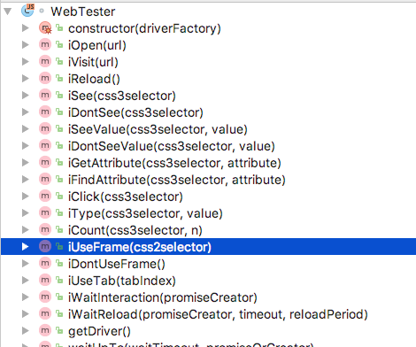

## plus.tester
- `npm install plus.tester --save-dev`
- `npm install selenium-webdriver chromedriver --save-dev`

### How to use

```javascript
    const seleniumWebdriver = require('selenium-webdriver');
    const { WebTester } = require('plus.tester');

    this.tester = new WebTester(() => new seleniumWebdriver.Builder().forBrowser('chrome').build());

    this.tester.getDriver()
         .then((driver) => driver.manage().timeouts().pageLoadTimeout(30 * 1000));
```

### Examples with cucumber.js
```gherkin

# features/google.feature
Feature: Example feature
  Scenario: Google
    Given I open google
    Then I see search line
    Then I click Lucky button
```

```javascript
/// features/step_definitions/google.js
let {defineSupportCode} = require('cucumber');

defineSupportCode(function({Given, When, Then}) {
    Given('I open google', function () {
        return this.iVisit('http://google.com');
    });

    Then('I see search line', function () {
        return this.iSee('input');
    });

    Then('I type {stringInDoubleQuotes}', function (stringInDoubleQuotes) {
        return this.iType('input', stringInDoubleQuotes);
    });

    Then('I click Lucky button', function () {
        return this.iClick(`input[name="btnI"]`);
    });

});
```

```javascript
// features/support/world.js
const {defineSupportCode} = require('cucumber');

function CustomWorld() {
    let {WebTester} = require('plus.tester');

    const seleniumWebdriver = require('selenium-webdriver');

    this.tester = new WebTester(() => new seleniumWebdriver.Builder().forBrowser('chrome').build());
    this.tester.setup({ waitTimeout: 20 * 1000});

    this.tester.getDriver()
        .then((driver) => driver.manage().timeouts().pageLoadTimeout(30 * 1000));

    this.tester.applyTo(this);
}

defineSupportCode(({setWorldConstructor, setDefaultTimeout}) => {
    setDefaultTimeout(60 * 1000);
    setWorldConstructor(CustomWorld)
});
```

```javascript
// features/step_definitions/hooks.js
let {defineSupportCode} = require('cucumber');

defineSupportCode(function({After}) {
    After(function() {
        return this.tester.stop();
    });
});
```

### WebTester Api

